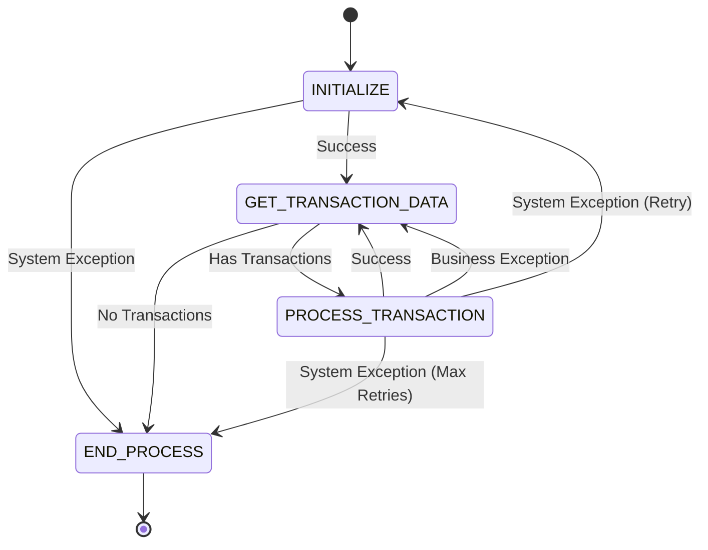
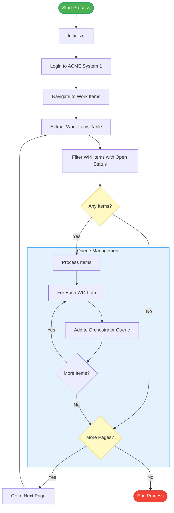
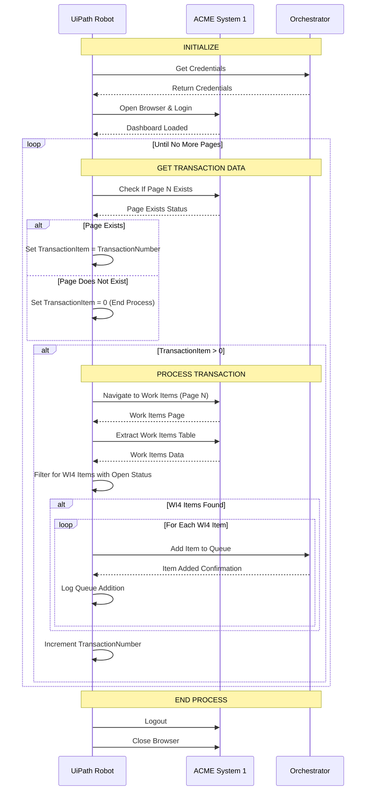

<div align="center">


<h1 align="center">Generate Yearly Report - Dispatcher</h1>
<h3 align="center">UiPath REFramework Implementation</h3>

  <p align="center">
    An RPA solution to automate the identification and queuing of vendor yearly report generation tasks
    <br />
    <br />
    <a href="#project-overview">Project Overview</a>
    ·
    <a href="#process-flow">Process Flow</a>
    ·
    <a href="#implementation-details">Implementation</a>
    ·
    <a href="#getting-started">Getting Started</a>
  </p>

 &emsp;
 &emsp;
 &emsp;

</div>

<div align="center">
  
</div>

## Project Overview

This project implements the Dispatcher component of a comprehensive RPA solution for generating yearly reports using the ACME System 1 web application. The Dispatcher identifies work items that require yearly report generation (WI4 type) and adds them to an Orchestrator queue for later processing by a separate Performer component. The automation follows the Robotic Enterprise Framework (REFramework), providing a structured approach for building robust, resilient, and maintainable automation solutions.

### Business Process

The Dispatcher component automates the following tasks:

1. Logs into ACME System 1
2. Navigates to the Work Items page
3. Extracts work items data
4. Filters for items of type WI4 with "Open" status
5. Adds qualified items to an Orchestrator queue for processing
6. Navigates through multiple pages to find all relevant work items

### Key Benefits

- **Efficient Work Discovery**: Automatically identifies all work items requiring yearly report generation
- **Centralized Queue Management**: Organizes tasks in a centralized Orchestrator queue
- **Scalable Architecture**: Separates work identification from processing for better resource utilization
- **Enhanced Auditability**: Maintains accurate records of identified work items

## REFramework Architecture

<div align="center">


</div>

## Process Flow

The Dispatcher follows the REFramework state machine model with four main states:

### Detailed Dispatcher Flow

<div align="center">



</div>

### Component Interaction



## Implementation Details

The Dispatcher is built using the UiPath REFramework template, which consists of the following key components:

### Project Structure

```
📦 Generate_Yearly_Report_Dispatcher
 ┣ 📂 Data
 ┃ ┣ 📄 Config.xlsx
 ┃ ┣ 📂 Input
 ┃ ┗ 📂 Temp
 ┣ 📂 Documentation
 ┣ 📂 Framework
 ┃ ┣ 📄 CloseAllApplications.xaml
 ┃ ┣ 📄 GetTransactionData.xaml
 ┃ ┣ 📄 InitAllApplications.xaml
 ┃ ┣ 📄 InitAllSettings.xaml
 ┃ ┣ 📄 KillAllProcesses.xaml
 ┃ ┣ 📄 Process.xaml
 ┃ ┣ 📄 RetryCurrentTransaction.xaml
 ┃ ┣ 📄 SetTransactionStatus.xaml
 ┃ ┗ 📄 TakeScreenshot.xaml
 ┣ 📂 Workflows
 ┃ ┣ 📂 System1
 ┃ ┃ ┣ 📄 System1_Close.xaml
 ┃ ┃ ┣ 📄 System1_FilterWIDatatable.xaml
 ┃ ┃ ┣ 📄 System1_Login.xaml
 ┃ ┃ ┣ 📄 System1_NavigateToWorkItems.xaml
 ┃ ┃ ┗ 📄 System1_ScrapeDataTable.xaml
 ┃ ┣ 📂 Common
 ┃ ┃ ┗ 📄 SendEmail.xaml
 ┣ 📄 Main.xaml
```

### Key Workflows

1. **System1_Login.xaml**: Handles authentication into ACME System 1
2. **System1_NavigateToWorkItems.xaml**: Navigates to the Work Items page
3. **System1_ScrapeDataTable.xaml**: Extracts the Work Items table into a DataTable
4. **System1_FilterWIDatatable.xaml**: Filters the DataTable for WI4 type items with "Open" status
5. **SendEmail.xaml**: Sends email notifications for exceptions

### Process.xaml - Core Business Logic

```vb
' Process.xaml - Main transaction processing logic
' This workflow handles the core dispatcher logic

Sequence DisplayName="Process"
    Variables:
        out_DataTable As DataTable
        io_FilteredDataTable As DataTable

    TryCatch
        Try:
            ' Log process start
            LogMessage "Started Process", Level: Info

            ' Navigate to Work Items page
            InvokeWorkflow "System1_NavigateToWorkItems.xaml"
                in_System1URL = in_Config("System1URL").ToString
                in_TransactionNumber = in_TransactionItem.ToString

            ' Extract Work Items data
            InvokeWorkflow "System1_ScrapeDataTable.xaml"
                in_System1URL = in_Config("System1URL").ToString
                out_DataTable = io_FilteredDataTable
                in_TransactionNumber = in_TransactionItem.ToString

            ' Filter Work Items for WI4 type with Open status
            InvokeWorkflow "System1_FilterWIDatatable.xaml"
                in_Type = "WI4"
                in_Status = "Open"
                io_FilteredDataTable = io_FilteredDataTable

            ' Log number of WI4 items found
            LogMessage "Found " + io_FilteredDataTable.Rows.Count.ToString + " WI4 items with Open status", Level: Info

            ' Add WI4 items to Orchestrator queue
            ForEach row in io_FilteredDataTable
                AddQueueItem
                    QueueName = in_Config("OrchestratorQueueName").ToString
                    FolderPath = in_Config("OrchestratorQueueFolder").ToString
                    Reference = "WI4_Item"
                    ItemInformation:
                        "WIID" = row("WIID").ToString
                        "Description" = row("Description").ToString
                        "Status" = row("Status").ToString
                        "Date" = Convert.ToDateTime(row("Date"))

                LogMessage "Added Work Item ID " + row("WIID").ToString + " to queue", Level: Info

        Catch ex As Exception:
            ' Log error
            LogMessage "Exception in Generate Yearly Report Dispatcher Process", Level: Error

            ' Prepare email notification with error details
            Assign ExceptionMessage = "Hello, An unhandled exception occurred in the Dispatcher process. Please check the attached screenshot."

            ' Rethrow the exception to be handled by the framework
            Rethrow
```

### GetTransactionData.xaml - Special Implementation

The Dispatcher process uses a modified `GetTransactionData.xaml` workflow that:

1. Checks if the current page number exists in ACME System 1
2. Sets the transaction item to the current page number if the page exists
3. Sets the transaction item to 0 to indicate no more transactions when all pages are processed

```vb
' Sequence to check if current page exists
Sequence DisplayName="Check if current page exists"
    ' Use Element Exists to check if the page number element exists
    ElementExists
        Target = FindElement("page=" + in_TransactionNumber.ToString)
        Result = PageExists

    ' If page exists, set TransactionItem to current page number
    If PageExists Then
        Assign out_TransactionItem = in_TransactionNumber
    Else
        ' If page doesn't exist, set TransactionItem to 0 to indicate no more transactions
        Assign out_TransactionItem = 0
    End If
```

### Exception Handling

The Dispatcher implements robust exception handling:

- **Business Exceptions**: Handled for each transaction without affecting others
- **System Exceptions**: Trigger application restart and retry mechanisms
- **Email Notifications**: Automated emails for critical errors with screenshot attachments
- **Logging**: Comprehensive logging at each step for auditability

## Getting Started

### Prerequisites

- UiPath Studio (2021.10 or later)
- Windows 10/11
- Microsoft Edge browser
- Internet connection to access ACME System 1
- Access to UiPath Orchestrator with queue management capabilities

### Configuration

The `Config.xlsx` file contains all the necessary settings:

1. **Settings sheet**:
    - **OrchestratorQueueName**: Name of the queue to add items to
    - **OrchestratorQueueFolder**: Folder path in Orchestrator
    - **System1URL**: URL for ACME System 1
    - **System1Credential**: Credential asset name in Orchestrator
    - **BusinessProcessName**: Process name for logging
    - **ExceptionEmail**: Email address for exception notifications

2. **Constants sheet**:
    - **MaxRetryNumber**: Maximum number of retries for failed transactions

### Installation

1. Clone or download the project
2. Open the project in UiPath Studio
3. Update the Config.xlsx file with your environment-specific settings
4. Publish the project to Orchestrator
5. Create the Orchestrator queue specified in the configuration

### Execution

1. Run the process manually or schedule it in Orchestrator
2. Monitor the Orchestrator queue to ensure it's being populated with WI4 items
3. After execution, check logs for any issues or exceptions
4. Deploy the corresponding Performer process to process the queued items

## Performance Metrics

- **Processing Time**: ~15-20 seconds per page
- **Success Rate**: >99% identification rate in production
- **Error Rate**: <1% with automated recovery for most errors
- **Capacity**: 7-15 vendor reports queued daily

## Security Considerations

- **Credential Management**: Credentials stored securely in Orchestrator
- **Error Handling**: No sensitive data exposed in error logs
- **Timeout Management**: Proper timeout settings to prevent hanging processes

## Contributing

If you would like to enhance this project:

1. Fork the repository
2. Create your feature branch (`git checkout -b feature/enhancement`)
3. Commit your changes (`git commit -m 'Add some enhancement'`)
4. Push to the branch (`git push origin feature/enhancement`)
5. Open a Pull Request

## License

Distributed under the MIT License. See `LICENSE` for more information.

---

<div align="center">
  <p>Built with ❤️ using UiPath REFramework</p>
</div>
